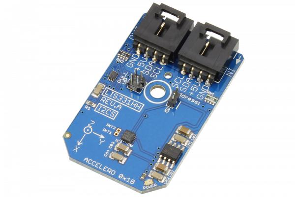

# LIS331HH

Manufactured by STMicroelectronics, the LIS331HH is an ultra low-power high performance accelerometer belonging to the “nano” family, with a digital I2C output.The LIS331HH has dynamically user-selectable full scales of ±6g/±12g/±24g and it is capable of measuring accelerations with output data rates from 0.5 Hz to 1 kHz.
This Device is available from www.ncd.io 

[SKU: LIS331HH_I2CS]

(https://store.ncd.io/product/lis331hh-mems-motion-sensor-ultra-low-power-full-scale-3-axis-accelerometer-i2c-mini-module/)
This Sample code can be used with Arduino.

Hardware needed to interface LIS331HH sensor with Arduino

1. <a href="https://store.ncd.io/product/i2c-shield-for-arduino-nano/">Arduino Nano</a>

2. <a href="https://store.ncd.io/product/i2c-shield-for-arduino-micro-with-i2c-expansion-port/">Arduino Micro</a>

3. <a href="https://store.ncd.io/product/i2c-shield-for-arduino-uno/">Arduino uno</a>

4. <a href="https://store.ncd.io/product/dual-i2c-shield-for-arduino-due-with-modular-communications-interface/">Arduino Due</a>

5. <a href="https://store.ncd.io/product/lis331hh-mems-motion-sensor-ultra-low-power-full-scale-3-axis-accelerometer-i2c-mini-module/">LIS331HH 3Axis Motion and Ultra Low Accelometer Sensor</a>

6. <a href="https://store.ncd.io/product/i%C2%B2c-cable/">I2C Cable</a>

LIS331HH:

Manufactured by STMicroelectronics, the LIS331HH is an ultra low-power high performance accelerometer belonging to the “nano” family, with a digital I2C output.The LIS331HH has dynamically user-selectable full scales of ±6g/±12g/±24g and it is capable of measuring accelerations with output data rates from 0.5 Hz to 1 kHz.

Applications:

• Gaming and virtual reality input devices

• Motion-activated functions

• Impact recognition and logging

• Vibration monitoring and compensation

How to Use the LIS331HH Arduino Library

The LIS331HH has a number of settings, which can be configured based on user requirements.
          
1.Data rate setting:The following command is used to set the data rate.

             lis.setAccelDataRate(ACCEL_DATARATE_50HZ);              // AODR (Hz): 50
            
2.Accleration range selection:The following command is used to select the range of acceleration.

               lis.setAccelRange(ACCEL_RANGE_6G);                      // ±6 G
